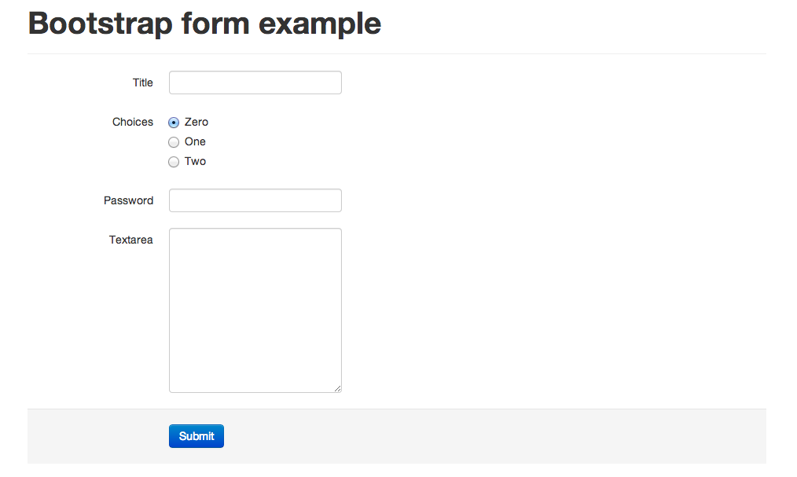

=======================
Django bootstrap 5 form
=======================

Generate twitter-bootstrap5 form output for django form

A simple Django template tag to work with twitter bootstrap 5 ( http://twitter.github.com/bootstrap/ )

Screenshot
-----------

Installation
------------

Install django-bootstrap5-form with pip

.. code-block:: sh

    $ pip install django-bootstrap5-form

Configuration
-------------

Add 'bootstrap5form' to INSTALLED_APPS.

.. code-block:: python

    INSTALLED_APPS = (
        ...
        'bootstrap5form',
        ...
    )

Usage
------

.. code-block:: none

    

    {{ form|bootstrap5 }}

    # or use with individual field
    {{ form.<field name>|bootstrap5 }} - To output individual fields

    # For horizontal forms
    {{ form|bootstrap5_horizontal }}
    
    # Or with custom size (default is 'col-lg-2 col-sm-2')
    {{ form|bootstrap5_horizontal:'col-lg-4' }}

CHANGELOG
---------

- 2021-05-07:

  Add support for Bootstrap 5

- 2013-8-27:

  Add support for Bootstrap 3, contributed by `Nivl <https://github.com/Nivl>`_

- 2013-5-7:

  Add `radio` support for ChoiceField
